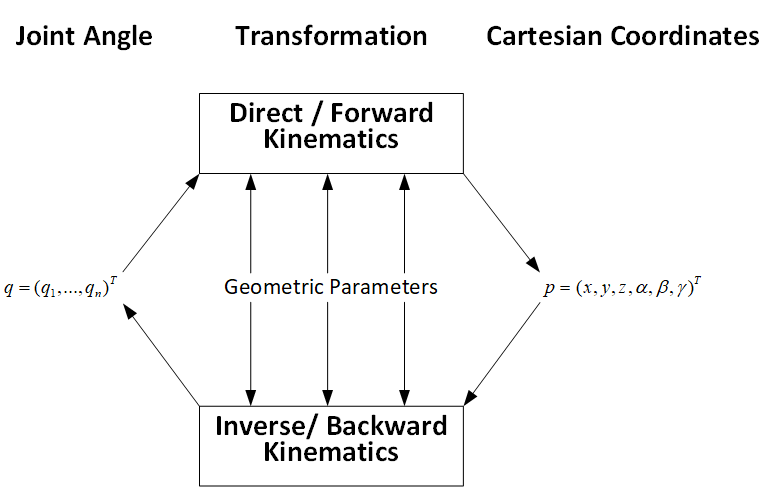
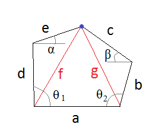
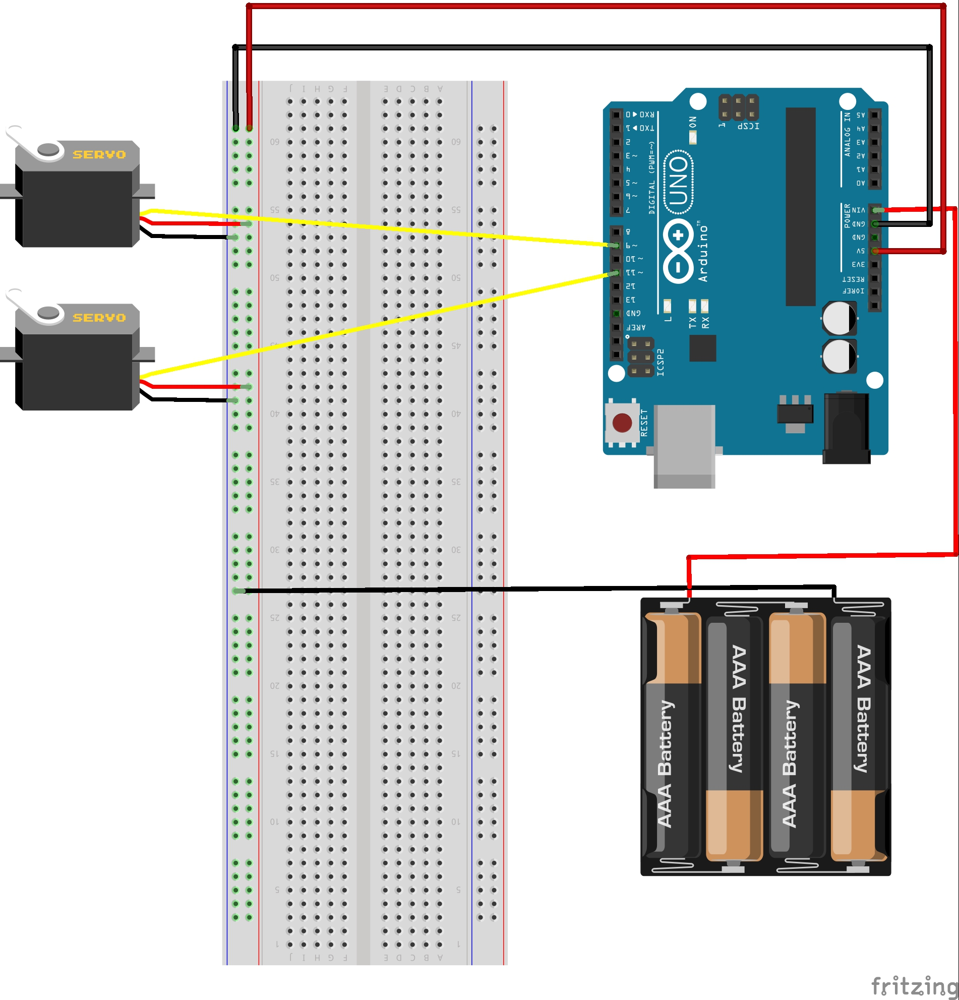
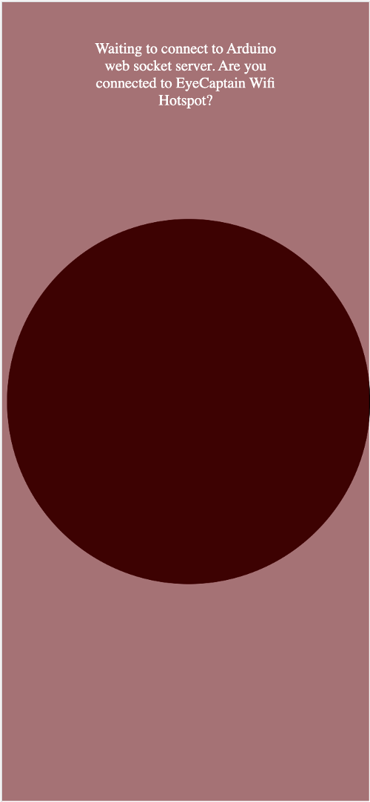
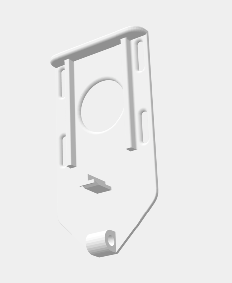
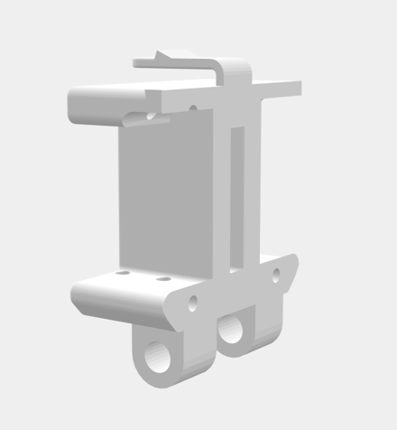
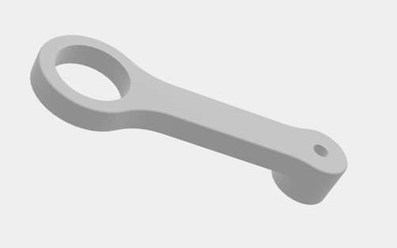
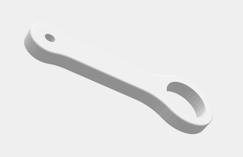
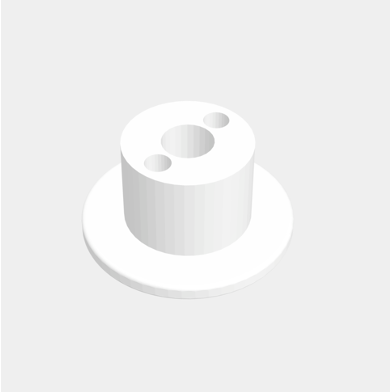
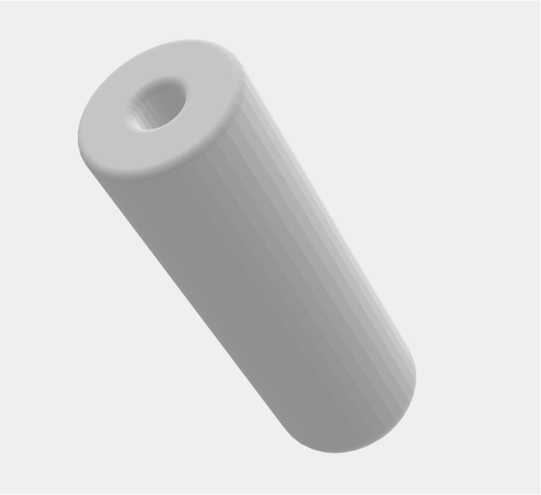

# EyeCaptain Mechanical Joystick Controller

This controller can be used to control a joystick if there is no direct digital interface, e.g. to control a wheelchair joystick that has no R-NET or DX-BUS interface. It consists of a 3d-printed part and an Arduino NodeMCU. The mechanical adapter is just mounted on the top of the existing joystick.

## Disclaimer

EyeCaptain does not take any responsibility for the use of the codes and hardware suggestions published here. If you use parts of this project for your own use or for another project, you do so at your own risk. You must check for yourself whether it is a medical device and, if necessary, observe and comply with the guidelines for use and publication applicable in your country. 

# The joystick adapter


We designed a 3D printable mechanical adapter, which can be adjusted in order fit many different joysticks. Two arms are moved by servo motors, which are controlled by an NodeMCU (similar to Arduino Nano, but with WIFI module). The NodeMCU itself is connected to a tablet (via USB or WIFI) and receives the data for direction and speed.

The mechanical adapter consists of four parts:

- 3D printed adapter
- NodeMCU 
- two servo motors (e.g. D-Power DS3218 RC Servo)
- external power supply (necessary because of the quite heavy power consumption of the servo motors)

There are two different ways to connect the NodeMCU to the tablet:
- USB cable
- WIFI

## What is inverse kinematics?

The approach we used in the design is called "inverse kinematics". This means, that the calculation of the coordination at the end of an kinematic line is done backwards. So instead of calculatig the coordinates of the joystick base on the angles of the servo motors, the angles are calculated from the coordinates provided by the devices that delivers x/y positions




The design resembles a 5 bar linkage as shown in the image below, but the horizontal bar a is replaced by the defined position of the servo motors. The two arms in our design consist of the parts "d", "e", "c" and "d", as shown in the image. The blue dot marks the joystick position from a top view and the angles theta1 and theta2 are the angles of the servo motors.




## Steps to build this project

### 1) Print the files in the CAD_Models folder
If you don't have an own 3D printer you may ask the next maker space around you. Very often you find kind people there who are willing to help with printing some parts. 

If you have no idea where the next maker space ist located, you may have a look on this site: [makerspaces.make.co](https://makerspaces.make.co/).

### 2) Assemble all parts (see the images of the assembled model at the top for now, instructions will follow)

### 3) Wire the NodeMCU to the servos and the power supply

The Arduino and the servo motors are connected as depicted in the following image: 



The image above only shows the schematics. For production use, we highly recommend to solder everything to a standard PCB instead of using a breadboard.


### 4) Configure and upload the arduino software to the NodeMCU


- Serial connection is set to `115200` bytes
- The Arduino/NodeMCU software receives X/Y-data (e.g. from a tablet or a phone) and controls the joystick movements with two servo motors and two arms.
- NodeMCU starts a Wifi Hotspot named `EyeCaptain` with the password `EyeCaptain`
- There is a websocket server running on the Ardino device.
- The current implementation of the Arduino-Code also has a webserver with a simple implementation for mobile phones (Folder: `Arduino/data/` that enables you to test the X/Y-position transmission. In order to upload it, you need to use the following Plugin for the Arduino IDE: https://github.com/esp8266/arduino-esp8266fs-plugin. All data that lies in the `Arduino/data` directory will be uploaded to the NodeMcu.
- Once the arduino is running, position data can be sent to either via Websocket-messages or via a Serial Port in the following structure:
```C
%<POSX>,<POSY>;
// e.g.Example:
%50,50;
```
- Position data is between -100/-100 (bottom left) and 100/100 (top right). 0/0 should be the center position
- Files and options that you should configure
    - `Arduino/InverseKinemetics.ino`:
        - Pin configuration
            - `SERVOPINLEFT`: pin of the left servo
            - `SERVOPINRIGHT`: pin of the right servo
        - Adjust the following factors until the servos move exactly 90 degrees
            - `SERVOFAKTORLEFT`: 
            - `SERVOFAKTORRIGHT`:
        - Adjust the NULL-values so that the servo arms are parallel at all times
            - `SERVOLEFTNULL`:  
            - `SERVORIGHTNULL`:
        - You might also need to change the following values:
            - `L1`, `L2`, `L3` (arm length)
            - `O1X`, `O1Y`, `O2X`, `O2Y` (origin point of left and right servo)
        - Parking positions if no data is comin in 
            - `PARKX`
            - `PARKY`        
    - `Arduino/data/websocket.js`: 
        - `IP_ADDRESS` must contain the IP address of the NodeMcU


### 5) Open your browser and connect to the NodeMCU via web iterface





# Explanation of the arduino codes:

- The arduino code in this project is based on the following work of Johannes Heberlein (2014). 
    - https://github.com/9a/plotclock


### Libraries 

Libraries needed:

- https://github.com/Links2004/arduinoWebSockets

```arduino
#include <ESP8266WiFi.h>
#include <ESP8266WiFiMulti.h>
#include <ArduinoOTA.h>
#include <ESP8266WebServer.h>
#include <ESP8266mDNS.h>
#include <FS.h>
#include <WebSocketsServer.h>
#include <Servo.h>
```

### Calibration

Calibration of servo motor position. Because the lever of the motors are never at the exact same position, it is necessary to calibrate the motors prior to first use in the project.

```arduino
// Adjust the following factor until the servos move exactly 90 degrees
// D-POWER-servos: 
#define SERVOFAKTORLEFT 700
#define SERVOFAKTORRIGHT 460
// Zero-position of left and right servos
// When in calibration mode, adjust the NULL-values so that the servo arms are at all times parallel
// either to the X or Y axiste
// D-Power servos Werte:
#define SERVOLEFTNULL 2000
#define SERVORIGHTNULL 1050
```

### Geometry factors

The following code describs the geometry of the adapter, which is used for the calculation of the angels (inverse kinematics).

```arduino
// length of arms
#define L1 35
#define L2 45
#define L3 0 //13.2

// origin points of left and right servo 
#define O1X 40
#define O1Y -25
#define O2X 48
#define O2Y -25
```

### WIFI connection

The nodeMCU sets up an access point for the tablet to log in (WIFI). The name of the network and the passwort are defined in the code.

```arduino
ESP8266WiFiMulti wifiMulti;       // Create an instance of the ESP8266WiFiMulti class, called 'wifiMulti'

ESP8266WebServer server(80);       // Create a webserver object that listens for HTTP request on port 80
WebSocketsServer webSocket(81);    // create a websocket server on port 81

File fsUploadFile;                 // a File variable to temporarily store the received file

const char *ssid = "EyeCaptain"; // The name of the Wi-Fi network that will be created
const char *password = "EyeCaptain";   // The password required to connect to it, leave blank for an open network

const char *OTAName = "eyecaptain";           // A name and a password for the OTA service
const char *OTAPassword = "eyecaptain";

const char* mdnsName = "eyecaptain"; // Domain name for the mDNS responder
```

### Serial connection

If the NodeMCU is connected to the tablet via WIFI, the serial connection is only for debugging. But you can also use the serial connecting for transmitting the coordinates from the tablet to the Arduino.

```arduino
Serial.begin(115200);        // Start the Serial communication to send messages to the computer
```


# Overview of the mechanics 3d Parts:

Base_Plate.stl


Servo_Mount.stl: Holds the two servos


Arm_1.stl


Arm_2.stl


Arm_Mount_Part1.stl


Arm_Mount_Part2.stl


Simple_Stick.stl

